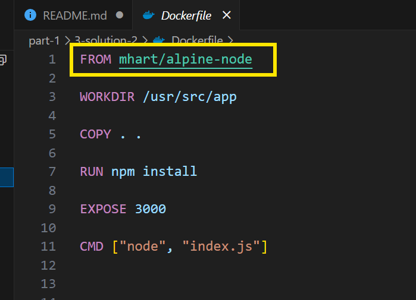

### How to create an image and run the container

    1. docker build . -t test_app       -(To Create An Image)
    2. docker images                    -(To Check All The Existing Images)
    3. docker run test_app              -(To Run The Image, (convert the image into a container))
    4. docker run -p 3000:3000 test_app -(To run the image by specifing/port mapping on which port this "test_app" should run) 
       NOTE : because there might be a possibility if we not specify  the port, then multiple container try running at same port, so better specify on which port it should be running.
    5. docker ps                        -(To check an image is started and container is running, it will return all the running container)

### How to push the created image on docker-hub 

    1. docker login
    2. docker build . -t rahulmahato29/first-repo-test
    3. docker push rahulmahato29/first-repo-test

   CHECK : DockerHub-Repo : https://hub.docker.com/r/rahulmahato29/first-repo-test

### How to run any image from docker-hub in your system

    1. Go to the specific image repository.
    2. And pull the image using link provided over there.

### Assignment-2
     
    Q - How to decrease the size of the Image ?
    
    alpine-version's are more lighter than the orignial one.